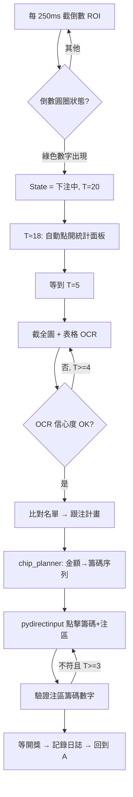

# 星城百家樂 — 自動跟注系統 規劃書（v0.2 精簡版）

> 環境：**Windows 本機，星城電腦版，單桌**
> 策略：**圖像辨識（OCR + 模板匹配）**，不碰封包 / 記憶體
> 觸發點：倒數 **T=5 秒** 截圖 + OCR + 下注；T=4s 備援

---

## 1. 為什麼選圖像辨識（而非讀程式背後資料）

| 方案 | 結論 |
|------|------|
| 封包攔截 | 通常有 TLS + 自訂加密,且屬外掛範疇,封號風險高 |
| 記憶體 / DLL Hook | 改版即失效,明確違反 ToS,法律風險最高 |
| Windows UI Automation | 星城是遊戲引擎自繪畫面,**抓不到任何文字** |
| **圖像辨識** | **不碰遊戲內部,等同「人在看螢幕」,安全;單次決策 50–150ms,足以塞進 5 秒下注窗** |

---

## 2. 功能需求

1. **跟住名單**：UI 隨時新增 / 刪除 / 啟用停用（單一玩家也可）
2. **開盤偵測**：被動輪詢倒數圓圈，出現綠色數字 → 進入下注狀態
3. **自動開統計面板**：開盤後 1–2 秒內點開「☰ → 📊」
4. **T=5s 擷取押注統計**：OCR 表格 → `{玩家: {注區: 金額}}`
5. **跟注計算**：從名單抓出對應玩家，1:1 跟注（他下啥我下啥、他下多少我下多少、多注區也跟）
6. **自動下注執行**：自動選對應籌碼 + 點對應注區
7. **籌碼自動湊額**：金額 → 最少籌碼點擊序列（1K / 5K / 10K / 50K / 100K / 500K）
8. **日誌與截圖**：每局留存，方便除錯與對帳
9. **停損 / 上限**：單局上限、單日虧損上限

---

## 3. 系統流程



### 狀態機
```
IDLE → BET_OPEN (T=20)
     → STATS_OPENED (T≈18)
     → DECIDED (T=5, 拿到計畫)
     → BETTING (T=5→3)
     → LOCKED (T=3, 倒數變紅)
     → SETTLED → IDLE
```

---

## 4. 模組結構

```
star_follow/
├─ capture/
│   ├─ window.py          # 找到星城視窗 HWND、取得 client 區座標
│   └─ screen.py          # MSS 截整圖 / 截 ROI
├─ vision/
│   ├─ templates/         # 注區、籌碼、統計面板、按鈕 PNG
│   ├─ roi.py             # 依視窗大小換算 ROI 座標
│   ├─ state.py           # 倒數圓圈狀態判斷（顏色 + OCR）
│   ├─ ocr.py             # PaddleOCR + Tesseract 包裝
│   └─ stats_parser.py    # 統計表格切 cell → 字典
├─ automation/
│   ├─ click.py           # pydirectinput 封裝（含隨機抖動）
│   ├─ chip_planner.py    # 金額拆解
│   └─ executor.py        # 下注流程
├─ core/
│   ├─ follow_list.py     # SQLite/JSON CRUD
│   ├─ engine.py          # 主迴圈 + 狀態機
│   ├─ aggregator.py      # 多人同注區加總（若日後要）
│   └─ risk.py            # 停損 / 上限
├─ ui/
│   └─ main.py            # PyQt6: 名單、即時狀態、日誌
├─ logs/                  # 截圖 + json 局紀錄
└─ config.yaml            # 籌碼面額、ROI 校正、延遲參數
```

---

## 5. 關鍵實作細節

### 5.1 開盤偵測（被動輪詢）
- 倒數圓圈 ROI ≈ 100×100 px
- 演算法：
  1. 取 ROI 平均色相 → 判斷綠 / 紅 / 灰
  2. 若為綠 → Tesseract `--psm 8 -c tessedit_char_whitelist=0123456789` 讀數字
  3. 讀到 18~20 視為「剛開盤」，鎖定狀態機
- CPU：250 ms 一次 + ROI 很小，幾乎無感

### 5.2 自動開統計面板
- 座標固定：右上角「☰」→ 跳出小面板 → 「📊」
- 模板匹配確認面板出現後才繼續，未出現重試 1 次
- **T≤20 開啟；T≈12 預讀認欄；T=6 截圖+定稿+關閉+立刻下注；T=5 備援；T=4～10 可點擊**

### 5.3 T=5s 統計表 OCR
- 表格欄列固定 → **直接切 cell 各自 OCR**（比整張快且準）
- 玩家暱稱第一次出現即快取，後續同局只 OCR 金額列
- 金額：數字白名單、去逗號、空白視為 0
- 失敗判斷：cell 信心度 < 0.6 → 在 T=4 重試一次

### 5.4 跟注計算（1:1 同步）
```python
plan = {}  # area -> amount
for name in follow_list.active():
    bets = stats.get(name, {})
    for area, amount in bets.items():
        plan[area] = plan.get(area, 0) + amount   # 多人時自動加總
plan = risk.cap(plan)
```

### 5.5 籌碼湊額（最少點擊）
- 可用面額：1K / 5K / 10K / 50K / 100K / 500K
- 全為彼此倍數 → **貪婪法即最佳解**
- 例：9000 = 5K×1 + 1K×4（5 次點擊）
- 例：73000 = 50K + 10K×2 + 1K×3（6 次點擊）

### 5.6 下注執行
```python
for area, amount in plan.items():
    for chip_value, times in plan_chips(amount):
        click(chip_pos[chip_value])
        for _ in range(times):
            click(area_pos[area], jitter=(20, 60))
```
- 每次點擊間隔 30–80 ms 隨機，模擬人手
- 全部完成後 OCR 各注區左上角「總額 / 0」小字驗證

### 5.7 注區 / 統計名稱對照
| 統計表 | 畫面注區 |
|--------|----------|
| 莊家 / 閒家 / 和局 | 莊 / 閒 / 和 |
| 莊對子 / 閒對子 | 莊對 / 閒對 |
| 幸運六 | 幸運六 |
| 莊龍寶 / 閒龍寶 | 莊龍寶 / 閒龍寶 |

---

## 6. 風險與對策

| 風險 | 對策 |
|------|------|
| 反自動化偵測 | pydirectinput + 隨機抖動 + 不修改遊戲；單日場次上限 |
| T=5 OCR 失敗 | T=4 重試；若仍失敗 → 跳過本局 |
| 統計面板未開啟 | 模板確認，最多重試 1 次 |
| 視窗被遮擋 / 移動 | 啟動時 / 每局開盤前重抓 HWND 與 client 區 |
| 解析度變動 | 校正工具：擷取目前視窗大小自動縮放模板與 ROI |
| 法律 / 條款 | 工具供研究用途，使用者自負風險 |

---

## 7. 開發里程碑

### Phase 1 — Demo 版（核心驗證：跟住功能能跑）
> 目標：**單一玩家、1:1 跟注、能穩定運作一個小時不出包**

| 階段 | 內容 |
|------|------|
| **M1 校正工具** | 一次性工具：框選視窗、擷取模板、編輯 ROI、產生 `config.yaml`（視窗大小固定 → 只需校正一次） |
| **M2 視覺管線** | 倒數狀態 + 統計表 OCR，CLI 即時印 JSON |
| **M3 下注引擎** | chip_planner + 點擊執行 + dry-run 模式 |
| **M4 簡易 UI** | 極簡視窗：跟住名單（新增/刪除）+ 啟動/停止 + 即時 log |
| **M5 實測調參** | 連跑數十局，確認 5s OCR + 下注流程穩定 |

### Phase 2 — 完整產品版（Demo 通過後再做）
| 項目 | 內容 |
|------|------|
| **跟注上限** | 例：對方 100K，我最多跟 10K；可按注區設不同上限 |
| **停損機制** | 單日虧損 X 元自動停；單局上限；連輸 N 局停 |
| **完整 UI** | PyQt6 完整介面：即時面板、歷史回放、統計圖表、設定頁、系統匣常駐 |
| **多人跟注 + 加總** | 同時跟多位玩家，同注區自動加總 |
| **日誌與對帳** | SQLite 完整局紀錄、匯出 CSV、勝率統計 |
| **異常通知** | OCR 連續失敗 / 跟丟 N 局 → 桌面通知 |

---

## 8. 技術棧

- Python 3.11
- `mss`、`opencv-python`、`numpy`、`Pillow`
- `paddleocr`（中文暱稱）+ `pytesseract`（數字、倒數）
- `pydirectinput`（點擊）
- `PyQt6`（UI）
- `pywin32`（找視窗）
- `SQLite`（名單 + 局紀錄）
- `PyInstaller`（打包單檔 exe）

---

## 9. 已確認事項

| 項目 | 決定 |
|------|------|
| 執行環境 | Windows 本機（星城電腦版） |
| 視窗大小 | **固定** → 校正只需做一次，模板與 ROI 寫死即可 |
| 跟住人數 | Demo 先做單人 1:1 跟注 |
| 跟注上限 | 列入 Phase 2，Demo 不做 |
| 停損機制 | 列入 Phase 2，Demo 不做 |
| UI | Demo 用極簡視窗（名單 + 啟停 + log）；完整 UI 列入 Phase 2 |

> **下一步**：進入 **M1 校正工具**。請提供：
> 1. 星城電腦版在你的螢幕上的**整張遊戲視窗截圖**（含視窗邊框，原始解析度，不要縮放）
> 2. 同樣狀態下「☰ 選單已展開」與「押注統計面板已開啟」各一張
>
> 拿到後就可以標好所有 ROI 座標、擷取模板，開始寫 M2。
